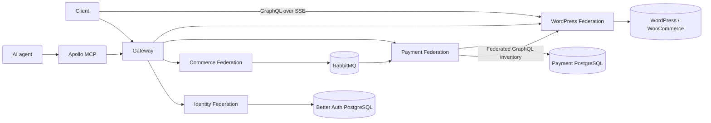
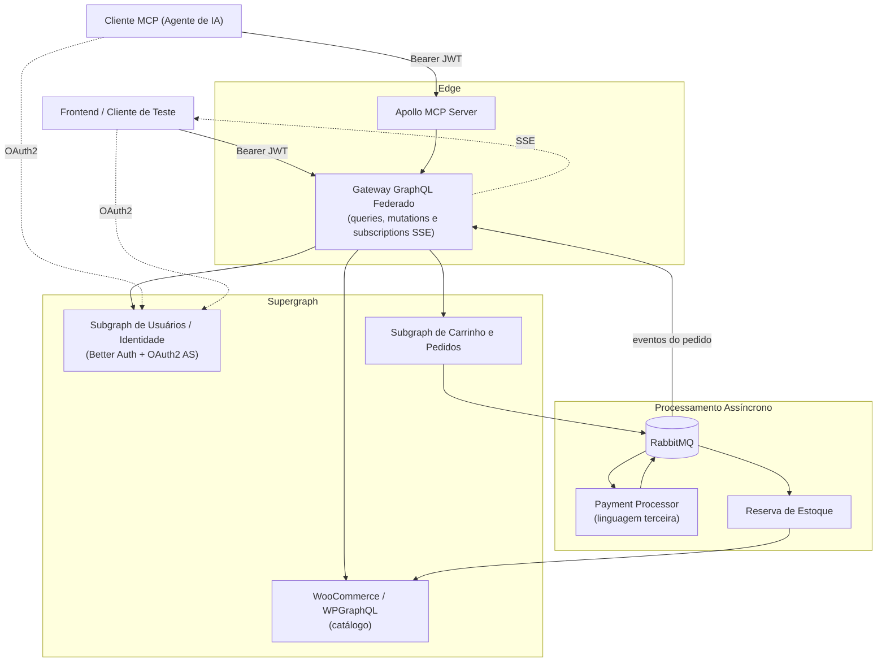
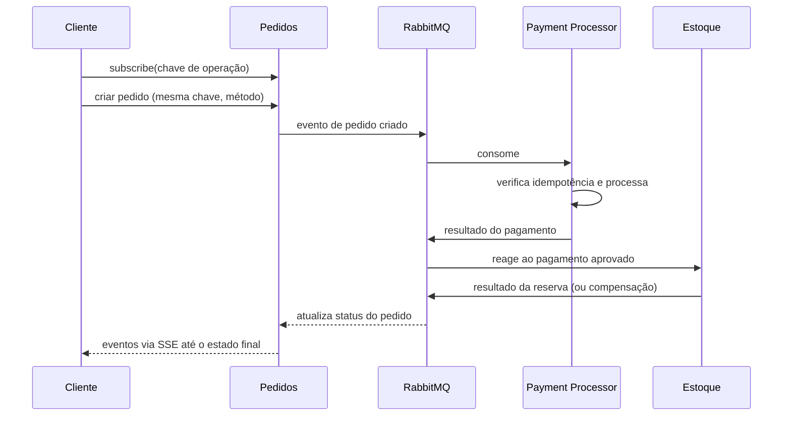

# Desafio Técnico — Marketplace B2B com GraphQL Federado, MCP e Saga de Pagamentos

> **Como ler este documento:** ele descreve **o que** precisa existir e **como será avaliado**.
> Modelagem de domínio, decomposição em serviços, nomes de eventos, topologia de filas, escolha de
> ORM/banco e estrutura de pastas são **parte do desafio** — onde não houver exigência explícita, a
> decisão é sua, e esperamos que ela esteja **justificada no README da sua entrega**.

## Delivered architecture walkthrough

The implementation uses six deployable applications and one
non-deployable end-to-end project:



| Runtime              | Single responsibility                                                                         | Composition boundary                                                                       |
| -------------------- | --------------------------------------------------------------------------------------------- | ------------------------------------------------------------------------------------------ |
| Apollo MCP           | Expose curated authenticated graph operations to agents                                       | Apollo MCP configuration and its Gateway endpoint                                          |
| Gateway              | Authenticate, propagate safe context, and compose queries and mutations                       | NestJS authentication providers and Apollo Gateway                                         |
| Identity Federation  | Own identity, sessions, OAuth, registration, and identity graph fields                        | `NestJSBetterAuth`, plugin factories, and Identity providers                               |
| Commerce Federation  | Own idempotent checkout workflow, transactional outbox, and order-event stream                | NestJS application services, PostgreSQL, and RabbitMQ publishers/consumers                 |
| Payment Federation   | Own payment invariants and the internal payment and inventory event consumers                 | Spring GraphQL Federation, Spring AMQP, and focused application boundaries                 |
| WordPress Federation | Expose authoritative product, cart, order, customer, inventory, and order-stream capabilities | Thin NestJS delegation to WPGraphQL/WooGraphQL and a provider-owned `graphql-sse` endpoint |

The domain rule is ownership, not uniformity: Better Auth owns its records,
WooCommerce owns commercial state, and Payment owns its aggregate and read
view. CQRS is used only in Payment, where an invariant-bearing write path and a
direct read view are materially different. Gateway and Apollo MCP remain
stateless edges. There is deliberately no Identity MikroORM mirror, generic DDD
framework, base repository hierarchy, gateway business orchestration, or
separate Stock worker. Inventory remains a distinct internal service boundary
inside the Java Payment Federation deployment.

WordPress integration is plugin-first: WPGraphQL, WooGraphQL, WPGraphQL
Federations, and WPGraphQL Headless Login provide the graph and session model.
Commerce publishes checkout through RabbitMQ. Payment Federation processes
payment and inventory events, and its inventory adapter calls WordPress
Federation GraphQL backed by the installed plugins. The resulting events drive
the Gateway SSE stream. There is no marketplace inventory MU-plugin.

Start with the [project map](docs/knowledge/Mapa%20do%20Projeto.md), then use the
[local development runbook](docs/runbooks/local-development.md) and the
[end-to-end runbook](docs/runbooks/e2e.md). The executable decision-to-evidence
matrix and recommended review order are in the
[federated platform review](docs/evidence/federated-platform-refactor/review.md).

---

## Sumário

1. [Visão Geral do Desafio](#1-visão-geral-do-desafio)
2. [Objetivos](#2-objetivos)
3. [Regras do Jogo: o que é obrigatório x o que é decisão sua](#3-regras-do-jogo-o-que-é-obrigatório-x-o-que-é-decisão-sua)
4. [Arquitetura de Alto Nível](#4-arquitetura-de-alto-nível)
5. [Capacidades Mínimas do Sistema](#5-capacidades-mínimas-do-sistema)
6. [Federação GraphQL (schema-first, Connections e DataLoader)](#6-federação-graphql-schema-first-connections-e-dataloader)
7. [Identidade e OAuth2 com Better Auth](#7-identidade-e-oauth2-com-better-auth)
8. [Subgraph de Usuários: `users`, `user` e `me`](#8-subgraph-de-usuários-users-user-e-me)
9. [Carrinho e Pedidos](#9-carrinho-e-pedidos)
10. [Pagamento: Saga, Idempotência e Subscriptions via SSE](#10-pagamento-saga-idempotência-e-subscriptions-via-sse)
11. [Servidor MCP (Apollo MCP)](#11-servidor-mcp-apollo-mcp)
12. [Processador de Pagamento em Linguagem Terceira](#12-processador-de-pagamento-em-linguagem-terceira)
13. [Observabilidade (opcional, desejável)](#13-observabilidade-opcional-desejável)
14. [Infraestrutura, Docker e Deploy](#14-infraestrutura-docker-e-deploy)
15. [Testes — E2E obrigatório](#15-testes--e2e-obrigatório)
16. [Requisitos Funcionais](#16-requisitos-funcionais)
17. [Requisitos Não-Funcionais](#17-requisitos-não-funcionais)
18. [Critérios de Aceitação e Avaliação](#18-critérios-de-aceitação-e-avaliação)
19. [Entregáveis](#19-entregáveis)
20. [Estrutura de Repositório](#20-estrutura-de-repositório)
21. [Referências](#21-referências)
22. [Glossário](#22-glossário)

---

## 1. Visão Geral do Desafio

Projetar e implementar uma **API GraphQL Federada para um marketplace B2B**, no qual:

- **Empresas (fornecedores)** cadastram, editam e removem seus próprios produtos.
- **Compradores** navegam pelo catálogo, adicionam produtos ao carrinho e realizam pedidos.
- O catálogo de produtos e pedidos vem de uma instância **WordPress + WooCommerce** exposta via
  GraphQL e participante da federação.
- **Usuários e fornecedores** (que o WooCommerce não cobre bem) são geridos por um **subgraph NestJS**,
  que também é a fonte de identidade do sistema.
- A aplicação **sobe seu próprio Authorization Server OAuth2**, usando o
  [plugin OAuth Provider do Better Auth](https://better-auth.com/docs/plugins/oauth-provider).
- Um **gateway GraphQL federado** compõe o supergraph e valida os tokens emitidos por esse AS.
- O **processamento de pagamentos é idempotente**, distribuído via **RabbitMQ**, coordenado por uma
  **saga coreografada**, e **observável em tempo real pelo frontend via GraphQL Subscriptions sobre
  Server-Sent Events**.
- Uma instância **Apollo MCP autenticada** contra esse mesmo AS expõe um subconjunto curado das
  operações do supergraph para consumo por agentes de IA.
- Toda a stack é **dockerizada** e coberta por um **teste E2E automatizado** que sobe o ambiente
  inteiro com Testcontainers.

---

## 2. Objetivos

| #   | Objetivo                                                                                                                    |
| --- | --------------------------------------------------------------------------------------------------------------------------- |
| O1  | Compor um supergraph **Apollo Federation v2 schema-first** entre WooCommerce e os subgraphs próprios.                       |
| O2  | Garantir que **apenas o fornecedor dono** de um produto possa criá-lo, alterá-lo ou removê-lo.                              |
| O3  | Subir um **Authorization Server OAuth2** com o **Better Auth OAuth Provider**, com clients seedáveis e audiences distintas. |
| O4  | Usar o **NestJS Better Auth** tanto no **gateway** quanto no **subgraph de usuários**.                                      |
| O5  | Expor `users`, `user(...)` e `me` no subgraph de usuários, com `me` navegando para pedidos e produtos de forma federada.    |
| O6  | Implementar **checkout idempotente** por chave de operação enviada pelo cliente.                                            |
| O7  | Coordenar o pagamento por **saga coreografada** sobre RabbitMQ, com compensações.                                           |
| O8  | Publicar os eventos do pedido ao frontend via **Subscriptions com `graphql-sse`** (SSE, não WebSocket).                     |
| O9  | Expor um **servidor Apollo MCP** autenticado via OAuth2, com `audience` corretamente configurada.                           |
| O10 | Implementar o **processador de pagamento em uma linguagem/runtime separado**, com arquitetura bem definida.                 |
| O11 | Aplicar corretamente **Relay Cursor Connections** e **DataLoader** (sem N+1).                                               |
| O12 | Entregar o **teste E2E automatizado** descrito na seção 15, verde do zero.                                                  |

---

## 3. Regras do Jogo: o que é obrigatório x o que é decisão sua

| Obrigatório (não negociável)                                      | Livre (queremos ver seu critério)                                  |
| ----------------------------------------------------------------- | ------------------------------------------------------------------ |
| Monorepo **Nx**                                                   | Quantos apps/libs, e como dividi-los                               |
| **Apollo Federation v2, schema-first** (SDL é a fonte da verdade) | Quantos subgraphs e o que vive em cada um                          |
| **Better Auth** como AS OAuth2 (plugin OAuth Provider)            | Estratégia de sessão, claims extras, formato de escopos            |
| **NestJS Better Auth** no gateway e no subgraph de usuários       | Como você fatia guards, decorators e contexto                      |
| **WordPress + WooCommerce** como origem de catálogo/pedidos       | Como você federa o WP (plugin, wrapper, ACL, proxy subgraph)       |
| **RabbitMQ** + **saga coreografada**                              | Exchanges, routing keys, nomes de eventos, DLQ, retry/backoff      |
| **Idempotência por chave de operação enviada pelo cliente**       | Onde a chave é persistida e como o replay é resolvido              |
| **Subscriptions via `graphql-sse`**                               | Como o gateway propaga o stream e como você evita perda de eventos |
| **Apollo MCP** com OAuth2 + `audience`                            | Quais tools além das mínimas exigidas                              |
| **Relay Cursor Connections** + **DataLoader**                     | Encoding do cursor, escopo e ciclo de vida dos loaders             |
| Pagamento em **runtime/linguagem separada**                       | Qual linguagem, e a arquitetura dentro dela                        |
| **Teste E2E** em Vitest + Testcontainers (seção 15)               | Helpers, fixtures, como o token é obtido                           |
| Docker para todos os serviços                                     | Base images, multi-stage, compose vs. Nx targets                   |

Modelagem de domínio, agregados, bounded contexts, nomes de tabelas, ORM e banco de dados de cada
serviço **não são prescritos** — mas são avaliados (seção 18).

---

## 4. Arquitetura de Alto Nível



> O diagrama é ilustrativo. Fundir ou separar serviços é permitido, desde que as capacidades da
> seção 5 existam e as fronteiras estejam justificadas.

---

## 5. Capacidades Mínimas do Sistema

| Capacidade             | Descrição                                                                                                                                         |
| ---------------------- | ------------------------------------------------------------------------------------------------------------------------------------------------- |
| **Gateway federado**   | Compõe o supergraph, valida o JWT do Better Auth, propaga identidade/contexto aos subgraphs e serve **queries, mutations e subscriptions (SSE)**. |
| **Identidade**         | Authorization Server OAuth2 (Better Auth), cadastro/login, vínculo do usuário com o WordPress, e o subgraph que resolve `users`, `user` e `me`.   |
| **Catálogo**           | WooCommerce federado: produtos, categorias, preço e estoque.                                                                                      |
| **Fornecedores**       | Vínculo usuário ↔ empresa e a regra de ownership de produto.                                                                                     |
| **Carrinho e Pedidos** | Carrinho do usuário autenticado e criação do pedido a partir dele, com chave de operação.                                                         |
| **Pagamento**          | Serviço separado que consome eventos, processa de forma idempotente e responde com sucesso/falha (cartão e pix).                                  |
| **Estoque**            | Reação ao pagamento aprovado reservando estoque, com compensação em caso de falha.                                                                |
| **Eventos ao cliente** | Stream de eventos do pedido para o frontend, correlacionado pela chave de operação.                                                               |
| **MCP**                | Apollo MCP autenticado, consumindo o **supergraph** (nunca um subgraph isolado).                                                                  |

---

## 6. Federação GraphQL (schema-first, Connections e DataLoader)

### 6.1 Schema-first

- Federation v2 (`@link(url: "https://specs.apollo.dev/federation/v2.x")`).
- O **SDL é a fonte da verdade**: os subgraphs NestJS devem ser escritos _schema-first_
  (SDL versionado no repositório, resolvers implementados contra ele). Abordagens _code-first_
  baseadas apenas em decorators **não atendem** este requisito.
- Composição validada em CI (`rover compose` / `rover subgraph check`), com o supergraph gerado
  como artefato de build.
- Entidades federadas devem ter `@key` **resolvível** (reference resolvers funcionando de fato,
  inclusive quando a entidade é referenciada por outro subgraph).

### 6.2 Relay Cursor Connections

Toda listagem paginável do supergraph — usuários, produtos, pedidos, itens de pedido — deve seguir a
[Relay Cursor Connections Specification](https://relay.dev/graphql/connections.htm):

- Argumentos `first`/`after` (e `last`/`before` quando fizer sentido).
- Tipos `XConnection`, `XEdge`, campo `cursor` por edge e `pageInfo` com
  `hasNextPage`, `hasPreviousPage`, `startCursor` e `endCursor`.
- **Cursores opacos e estáveis** (nada de `offset` disfarçado que quebre com inserções concorrentes).
- Paginação real no _datasource_ — não paginar em memória depois de trazer tudo.

Será avaliado inclusive nas listas que atravessam a federação (ex.: pedidos de um usuário, itens de
um pedido) e nas listas expostas pelo WooCommerce.

### 6.3 DataLoader e N+1

- Uso de [DataLoader](https://github.com/graphql/dataloader) (ou equivalente com batching + cache
  por request) em **todo** resolver que resolva entidade por id, incluindo os reference resolvers
  `__resolveReference` da federação.
- Escopo do loader **por requisição** — cache global compartilhado entre usuários é falha grave.
- Consultas como `me { orders { edges { node { items { edges { node { product { ... } } } } } } } }`
  não podem gerar uma query/HTTP call por item.
- **Como será verificado:** contagem de queries no banco e de chamadas HTTP ao WooCommerce durante o
  teste E2E, e/ou logs de batching. Deixe isso observável (log, métrica ou hook de teste).

---

## 7. Identidade e OAuth2 com Better Auth

### 7.1 Authorization Server

A aplicação **sobe seu próprio servidor OAuth2** usando o
[Better Auth OAuth Provider](https://better-auth.com/docs/plugins/oauth-provider). Requisitos:

- Authorization Code + PKCE para clientes interativos e Client Credentials onde fizer sentido.
- Emissão de **JWT** verificável pelos consumidores (gateway e MCP) — expor discovery e JWKS.
- **Escopos** e **`audience`** por client: o gateway e o servidor MCP são _resource servers_
  distintos e devem validar `aud` e `scope`.
- **Clients OAuth2 seedáveis** por script/fixture (ver seção 15): ao menos um client para o
  **Apollo MCP** e outro para o **cliente de teste**.

### 7.2 Integração NestJS

O [NestJS Better Auth](https://better-auth.com/docs/integrations/nestjs) deve ser usado nos **dois**
lados:

- **Gateway** — validação do token, extração da sessão/usuário e propagação de contexto aos subgraphs.
- **Subgraph de usuários** — dono da instância do Better Auth (schema, tabelas e endpoints do AS),
  resolvendo `me` a partir da sessão/token.

### 7.3 Cadastro de usuário e vínculo com o WordPress

Criar um usuário no sistema deve, na mesma operação lógica:

1. Criar o usuário no Better Auth, com a conta de login `email`/password.
2. Criar/associar o usuário correspondente no **WordPress**, para que ele exista na federação e possa
   ser autenticado lá.
3. Registrar esse vínculo na tabela **`accounts`** do Better Auth como uma conta de provider
   **`wordpress`** — de modo que o usuário tenha, ao final, **duas contas**: `email` e `wordpress`.

> **Não reinvente a roda.** O Better Auth já oferece boa parte dessas APIs através do service exposto
> pela integração NestJS. O esperado é apenas **modelar a operação no domínio e adaptá-la na
> infraestrutura** — por exemplo, um `SignUpService` no `domain` (porta) com um
> `SignUpBetterAuthService` na `infrastructure` (adapter) que orquestra as chamadas do Better Auth e
> o vínculo com o WordPress. Reimplementar hashing, sessão, fluxo OAuth2 ou tabelas que o Better Auth
> já provê conta **contra** a avaliação.

### 7.4 Autorização

| Claim   | Descrição                                                           |
| ------- | ------------------------------------------------------------------- |
| `sub`   | ID do usuário                                                       |
| `aud`   | Resource server alvo (gateway / MCP)                                |
| `scope` | Escopos concedidos ao client                                        |
| demais  | A critério da sua modelagem (papéis, fornecedor, etc.) — justifique |

Regras mínimas:

- Um fornecedor só pode criar/editar/remover produtos que pertençam à sua empresa.
- Operações de carrinho e pedido são sempre do usuário autenticado — nunca aceite `userId` do cliente.
- O servidor MCP recusa requisições sem token válido, com `audience` errada ou sem os escopos exigidos.

---

## 8. Subgraph de Usuários: `users`, `user` e `me`

O subgraph de usuários deve expor, no mínimo:

```graphql
type Query {
  users(first: Int, after: String): UserConnection! # lista geral, Relay Connection
  user(id: ID!): User # busca por identificador
  me: User # usuário autenticado pelo token da requisição
}
```

Requisitos:

- `me` é resolvido **exclusivamente** a partir do token/sessão da requisição.
- `User` é entidade federada e deve permitir navegar, **de forma federada e sem N+1**, para:
  - os **pedidos** do usuário (Connection), e
  - os **produtos** de cada pedido (resolvidos no subgraph do catálogo).
- Uma única query `me { ... }` deve ser capaz de devolver dados do usuário, seus pedidos (com status,
  método de pagamento e, quando pix, o código gerado) e os produtos de cada pedido.

O restante do schema (campos, tipos auxiliares, nomes) é decisão sua.

---

## 9. Carrinho e Pedidos

- Adicionar/remover produtos do carrinho do usuário autenticado.
- Criar o pedido a partir do carrinho, informando o **método de pagamento** (`cartão` ou `pix`) e a
  **chave de operação/idempotência** (seção 10.1).
- Consultar os pedidos do usuário (Connection) e um pedido específico, com o **status atual** da saga.
- O pedido é a fonte de verdade do resultado final da saga: o status exposto na query deve convergir
  para o mesmo estado final observado na subscription.

---

## 10. Pagamento: Saga, Idempotência e Subscriptions via SSE

### 10.1 Chave de operação / idempotência

A chave de operação (idempotency key) é **gerada pelo cliente** e enviada na mutation de criação do
pedido. Por ser conhecida antes da chamada, ela tem duas funções:

1. **Idempotência ponta a ponta.** Repetir a mutation com a mesma chave — inclusive por retry do
   frontend, do gateway ou do próprio broker — **não pode** criar um segundo pedido nem gerar uma
   segunda cobrança. A resposta deve ser equivalente à da primeira chamada.
2. **Correlação do stream.** É por essa mesma chave que o cliente **abre a subscription** dos eventos
   daquele pedido, **sem precisar conhecer o `orderId` de antemão** — e, portanto, podendo assinar
   **antes** de disparar a mutation.

A propagação da chave até o processador de pagamento e a estratégia de deduplicação (tabela de
idempotência, constraint única, outbox, dedupe no consumidor…) são **decisão sua**.

### 10.2 Subscriptions

- O cliente abre uma subscription **baseada na chave de operação** e recebe a progressão do pedido
  até um **estado final**.
- **A subscription pode (e deve poder) ser aberta antes da mutation.** Como a chave é gerada pelo
  cliente, o fluxo esperado é: assinar com a chave → disparar a mutation com a mesma chave →
  consumir os eventos. Assinar uma chave que ainda não tem pedido não é erro: o stream fica aberto
  aguardando os eventos daquela operação.
- Com isso, **não exigimos replay de eventos passados**. Garantir que quem assina depois da mutation
  também receba o histórico (buffer, replay a partir de um log/outbox, snapshot do estado atual no
  primeiro evento) é **desejável e conta como diferencial**, não é obrigatório.
- Somente o dono do pedido pode assinar os eventos daquela chave — uma chave de outro usuário não
  pode ser assinada.

### 10.3 Transporte: Server-Sent Events

As subscriptions devem ser implementadas com [`graphql-sse`](https://github.com/enisdenjo/graphql-sse)
(**SSE**), do subgraph ao gateway e do gateway ao cliente. **WebSockets não atendem este requisito.**

> **Por quê:** em arquiteturas federadas, subscriptions sobre SSE são muito mais proveitosas —
> mantêm o transporte em HTTP puro (compatível com o mesmo pipeline de auth, headers, proxies, load
> balancers e infra serverless/ECS do resto do supergraph), evitam um segundo protocolo com estado
> próprio no gateway, e simplificam a propagação do `Authorization` para os subgraphs. Escrever
> gateways federados que rodam subscriptions via SSE em vez de WebSockets é o comportamento esperado
> aqui — e a justificativa deve aparecer na sua documentação.

### 10.4 Métodos de pagamento e estados finais

| Método | Estado final esperado  | Requisito adicional                      |
| ------ | ---------------------- | ---------------------------------------- |
| Cartão | Pagamento **aprovado** | Pedido reflete a aprovação               |
| Pix    | **Pix gerado**         | O pedido carrega o **código pix** gerado |

Os nomes exatos dos estados são seus; a semântica acima é obrigatória.

### 10.5 Saga



Requisitos: coreografia (sem orquestrador central), consumo concorrente seguro, compensação quando a
reserva de estoque falhar, DLQ e retry com backoff. **Nomes de eventos, exchanges, routing keys e
filas são decisão sua** — documente a topologia escolhida.

---

## 11. Servidor MCP (Apollo MCP)

- Servidor **Apollo MCP** apontando para o **supergraph federado** (nunca para um subgraph isolado).
- Autenticação OAuth2 conforme a
  [documentação de auth do Apollo MCP Server](https://www.apollographql.com/docs/apollo-mcp-server/auth),
  usando o **Better Auth como Authorization Server**, com a **`audience` devidamente configurada** e
  validação de escopos.
- O token do usuário é propagado ao gateway, de modo que uma tool executa com **exatamente a mesma
  identidade e as mesmas regras** de uma chamada GraphQL direta.
- **Whitelist explícita** de operações registradas como tools. Sugestão de conjunto (ajuste conforme
  sua modelagem, mantendo os mínimos):

| Tool                           | Tipo     | Obrigatória                  |
| ------------------------------ | -------- | ---------------------------- |
| `me`                           | Query    | **Sim** (usada no teste E2E) |
| `searchProducts`               | Query    | Sim                          |
| `getProduct`                   | Query    | Sim                          |
| `getMyCart`                    | Query    | Sim                          |
| `getMyOrders`                  | Query    | Sim                          |
| `addToCart` / `removeFromCart` | Mutation | Sim                          |

> ❌ **Não expor:** criação de pedido/captura de pagamento, mutações de catálogo e qualquer operação
> administrativa.

Deve rejeitar: requisição sem token, token com `audience` incorreta e token sem os escopos exigidos.

---

## 12. Processador de Pagamento em Linguagem Terceira

O processador de pagamento deve rodar em um **runtime separado dos subgraphs** e, preferencialmente,
em **outra linguagem de programação**.

- Aceita-se um app **NestJS híbrido** (`nestjs-microservices` + RabbitMQ,
  [hybrid application](https://docs.nestjs.com/faq/hybrid-application)) — mas **reproduzir uma
  arquitetura bem idealizada, no nível do que o Nest oferece (camadas, DI, ports/adapters,
  testabilidade, configuração, health check, graceful shutdown), em outra linguagem faz parte do
  desafio** e será valorizado.
- Requisitos independentes da linguagem: consumo concorrente seguro, idempotência comprovada,
  publicação confiável do resultado, DLQ/retry, e imagem Docker própria.
- A imagem é subida pelo teste E2E via Testcontainers — ela precisa funcionar sem passos manuais.

---

## 13. Observabilidade (opcional, desejável)

> **Escopo:** OpenTelemetry é **opcional**, porém **desejável** — vale como diferencial na avaliação,
> não como reprovação se ausente.

Se implementado, o esperado é:

- **Traces** propagados via `traceparent` do cliente até os workers, **atravessando o RabbitMQ**.
- **Métricas** RED por resolver GraphQL e de consumo das filas.
- **Logs estruturados** correlacionados por `trace_id`/`span_id`.
- Um backend local no compose (Otel Collector + Jaeger, SigNoz, ou equivalente) e evidência visual.

---

## 14. Infraestrutura, Docker e Deploy

### 14.1 Docker

- `Dockerfile` multi-stage para cada serviço (builder + runtime enxuto).
- `docker compose up` sobe o ambiente completo: subgraphs, gateway, MCP, WordPress, RabbitMQ e bancos.
- **Healthchecks em todos os containers** — o teste E2E depende deles para orquestrar a subida.

### 14.2 Deploy (SST)

- Stack **SST v3** em TypeScript, com infraestrutura como código (sem cliques no console).
- Segredos via `sst.Secret`/Secrets Manager — **nunca** commitados.
- Pipeline de CI demonstrando build, teste, `sst diff` em PR e `sst deploy`.

---

## 15. Testes — E2E obrigatório

### 15.1 Stack de teste

- **Vitest** (TypeScript).
- **[Testcontainers](https://testcontainers.com/)** para subir **todos** os serviços necessários:
  bancos de dados, WordPress, RabbitMQ, Apollo MCP, os apps do monorepo e o **container do
  processador de pagamento** escrito na linguagem terceira.
- O teste deve rodar **do zero, com um único comando**, sem depender de nenhum serviço previamente no
  ar, e deve ser executável em CI.

### 15.2 Roteiro obrigatório

O teste E2E precisa executar, de ponta a ponta:

1. **Seed dos clients OAuth2 do Better Auth**: um client para o **Apollo MCP** e outro para o
   **cliente de teste**.
2. **Criação de um usuário**, refletindo essa criação também no **WordPress** (para que ele exista na
   federação e possa ser autenticado lá) e registrando o vínculo na tabela **`accounts`** do Better
   Auth como conta **`wordpress`**, além da conta **`email`** de login e senha.
3. **Seed do WordPress com um produto X** (pode ser direto no banco).
4. **Geração de um token de autenticação** para esse usuário via fluxo OAuth2. A estratégia é sua:
   JWT emitido/forjado dentro da estrutura OAuth2 com a secret/algoritmo corretos e os escopos e
   `audience` necessários, ou
   [automação de interface do fluxo real](https://totalshiftleft.ai/blog/oauth-api-testing-best-practices).
5. **Cliente MCP conectado ao Apollo MCP** com o header `Authorization` usando **o mesmo token**.
6. **Adicionar o produto X ao carrinho** do usuário, autenticado com o token gerado.
7. **Abrir a subscription** dos eventos do pedido usando uma chave de operação/idempotência gerada
   no teste — antes de existir o pedido.
8. **Criar o pedido a partir do carrinho** enviando **essa mesma chave**, e consumir a subscription
   como faria o frontend até o estado final, **guardando o último status recebido em uma variável**.
9. **Executar a query `me`**, que deve retornar os dados do usuário dono do token, **seus pedidos** e
   **os produtos desses pedidos**, corretamente federados.
10. **Executar a mesma query como uma tool MCP**, pelo cliente MCP conectado no passo 5.

### 15.3 Asserções obrigatórias

- O pagamento foi processado com sucesso, conforme o **último status capturado na subscription**.
- A query `me` devolve usuário + pedidos + produtos dos pedidos, permitindo exibir tudo relacionado ao
  usuário em uma única consulta federada.
- O resultado da query `me` via **tool MCP** é **exatamente o mesmo** da query GraphQL direta.
- O **status do último pedido** na lista de pedidos do usuário é **igual** ao **último status salvo na
  subscription**:
  - **cartão** → estado final de **pagamento aprovado**;
  - **pix** → estado final de **pix gerado**, e o pedido contém o **código pix**.
- Reenviar a mutation de criação de pedido com a **mesma chave de operação** não cria um segundo
  pedido nem uma segunda cobrança.

### 15.4 Outros testes

- Testes unitários/integração nos domínios críticos (pedidos e pagamento), com cobertura mínima de 70%.
- Teste de rejeição do MCP: sem token, com `audience` inválida e sem escopo exigido.

---

## 16. Requisitos Funcionais

| ID   | Requisito                                                                                                                             |
| ---- | ------------------------------------------------------------------------------------------------------------------------------------- |
| RF01 | Usuários se registram e autenticam via OAuth2 emitido pelo **Better Auth OAuth Provider**.                                            |
| RF02 | O cadastro cria o usuário no WordPress e o vincula via conta `wordpress` na tabela `accounts`.                                        |
| RF03 | Usuários podem se tornar fornecedores ao cadastrar uma empresa.                                                                       |
| RF04 | Apenas o fornecedor dono pode criar/editar/deletar seus produtos.                                                                     |
| RF05 | Compradores buscam produtos, veem detalhes e adicionam ao carrinho.                                                                   |
| RF06 | O subgraph de usuários expõe `users` (Connection), `user(id)` e `me`.                                                                 |
| RF07 | `me` navega para pedidos do usuário e produtos dos pedidos de forma federada.                                                         |
| RF08 | Compradores criam pedidos a partir do carrinho, informando método de pagamento e chave de operação.                                   |
| RF09 | O checkout é idempotente por chave de operação, inclusive sob retry do frontend.                                                      |
| RF10 | O cliente acompanha os eventos do pedido por subscription correlacionada pela chave de operação, podendo assiná-la antes da mutation. |
| RF11 | As subscriptions trafegam por **SSE** (`graphql-sse`).                                                                                |
| RF12 | A saga processa o pagamento e reserva estoque, compensando em caso de falha.                                                          |
| RF13 | Pagamento por cartão termina aprovado; por pix, termina com pix gerado e código no pedido.                                            |
| RF14 | O servidor MCP expõe apenas tools curadas de leitura e carrinho, sobre o supergraph.                                                  |
| RF15 | O servidor MCP exige token OAuth2 válido, com `audience` e escopos corretos.                                                          |

---

## 17. Requisitos Não-Funcionais

| ID    | Requisito                                                                |
| ----- | ------------------------------------------------------------------------ |
| RNF01 | Federation v2 **schema-first**, com composição validada em CI.           |
| RNF02 | Relay Cursor Connections em todas as listagens paginadas.                |
| RNF03 | Ausência de N+1 comprovada (DataLoader com batching por request).        |
| RNF04 | Serviços stateless; estado em banco/broker.                              |
| RNF05 | Workers escaláveis horizontalmente com idempotência comprovada.          |
| RNF06 | Cobertura mínima de 70% nos domínios críticos (pedidos e pagamento).     |
| RNF07 | Teste E2E da seção 15 verde, do zero, em CI.                             |
| RNF08 | Segredos nunca commitados.                                               |
| RNF09 | Deploy reprodutível via `sst deploy`, sem passos manuais.                |
| RNF10 | P95 < 500 ms nas queries do gateway em carga local.                      |
| RNF11 | _(desejável)_ Traces, métricas e logs correlacionados via OpenTelemetry. |

---

## 18. Critérios de Aceitação e Avaliação

**Todos os eixos abaixo são obrigatórios, exceto onde marcado como bônus.**

### 18.1 GraphQL e Federação — _peso maior_

- Uso correto e completo da **Relay Cursor Connections Specification**, inclusive em listas federadas.
- **DataLoader** aplicado consistentemente, sem N+1 nas queries do teste E2E — com evidência.
- Federação **schema-first** consistente e bem arquitetada: fronteiras de entidade coerentes, `@key`
  resolvíveis, ausência de campos "vazando" de contexto errado, composição limpa.
- Subscriptions federadas funcionando via SSE.

### 18.2 Estrutura de Código e Domínio

- **DDD aplicado de verdade**: bounded contexts explícitos, agregados com invariantes, eventos de
  domínio nomeados na linguagem ubíqua — e não apenas pastas com nomes de camadas.
- Separação clara entre domínio, aplicação, infraestrutura e apresentação, com o domínio **livre de
  dependências de framework**.
- Portas e adapters usados onde há integração externa (ex.: o cadastro sobre o Better Auth).
- Convenções uniformes (lint, format, conventional commits) e nomenclatura alinhada ao domínio.

### 18.3 Autenticação e MCP

- Better Auth realmente atuando como Authorization Server OAuth2, com clients seedáveis.
- NestJS Better Auth presente no gateway **e** no subgraph de usuários.
- MCP consumindo o supergraph, autenticado por OAuth2 com `audience` correta, recusando tokens
  inválidos.
- Validação com o `mcp-inspector` (`npx @modelcontextprotocol/inspector`), com evidências
  (screenshots/gravação): conexão autenticada, listagem das tools curadas, execução de pelo menos
  `me`, `searchProducts` e `addToCart`, e rejeição sem token ou com escopo inválido.

### 18.4 Pagamento, Saga e Idempotência

- Idempotência comprovada (mesma chave → mesmo efeito), inclusive sob retry e consumo concorrente.
- Compensação correta quando a reserva de estoque falha.
- Publicação confiável de eventos (atomicidade entre commit e publicação).
- Processador em runtime/linguagem separada, com arquitetura bem definida na linguagem escolhida.

### 18.5 Escalabilidade e Deploy

- Serviços stateless, workers escaláveis, cache de JWKS no gateway.
- Stack SST funcional, infraestrutura como código, segredos gerenciados.
- Pipeline CI/CD com build, test, `sst diff` e `sst deploy`.

### 18.6 Testes

- O teste E2E da seção 15 roda do zero e passa, cobrindo **todos** os passos e asserções listados.

### 18.7 Observabilidade — _bônus_

- Traces ponta a ponta (gateway → subgraphs → RabbitMQ → workers), métricas RED e logs com `trace_id`.

---

## 19. Entregáveis

- **Monorepo Nx**, público ou compartilhado, com `apps/` e `libs/` organizados.
- README com instruções para rodar localmente (`docker compose up`) e para rodar o teste E2E.
- Documentação da arquitetura: decisões tomadas, topologia de mensageria, estratégia de idempotência,
  estratégia de subscriptions e desenho da federação.
- Coleção Postman/Insomnia/HTTPie das operações principais.
- Scripts de seed (clients OAuth2, usuários, fornecedores, produtos).
- Evidências do `mcp-inspector`.

> ⚠️ **Entregas após 08/07/2026 às 12:00 (BRT) serão consideradas não finalizadas.**

---

## 20. Estrutura de Repositório

O projeto **deve ser entregue em um monorepo Nx**, seguindo as convenções do Nx (`apps/` para
aplicações executáveis, `libs/` para bibliotecas compartilhadas):

```
marketplace-challenge/
├── apps/          # gateway, subgraphs, MCP, workers, processador de pagamento, WordPress
├── libs/          # contratos GraphQL, código compartilhado
├── infra/         # stack SST
├── tools/         # scripts e generators
├── docker-compose.yml
├── nx.json
└── README.md
```

**A divisão interna de `apps/` e `libs/` é decisão sua** e faz parte da avaliação — queremos ver como
você desenha as fronteiras.

> **Importante:** o uso do Nx é obrigatório e espera-se aproveitamento real dos seus recursos —
> `nx affected`, project graph, task pipelines, cache (local e/ou Nx Cloud) e generators para
> padronizar a criação de libs/apps.

---

## 21. Referências

- [Better Auth — OAuth Provider plugin](https://better-auth.com/docs/plugins/oauth-provider)
- [Better Auth — Integração NestJS](https://better-auth.com/docs/integrations/nestjs)
- [Apollo MCP Server — Auth](https://www.apollographql.com/docs/apollo-mcp-server/auth)
- [Relay Cursor Connections Specification](https://relay.dev/graphql/connections.htm)
- [DataLoader](https://github.com/graphql/dataloader)
- [graphql-sse](https://github.com/enisdenjo/graphql-sse)
- [Testcontainers](https://testcontainers.com/)
- [NestJS — Hybrid application](https://docs.nestjs.com/faq/hybrid-application)
- [OAuth API testing best practices](https://totalshiftleft.ai/blog/oauth-api-testing-best-practices)
- [Apollo Federation v2](https://www.apollographql.com/docs/federation)

---

## 22. Glossário

### Operação e evidências da entrega

Para executar a entrega completa, consulte os [runbooks de desenvolvimento local](docs/runbooks/local-development.md), [E2E](docs/runbooks/e2e.md) e [deploy](docs/runbooks/deployment.md). A [coleção HTTP](docs/operations/marketplace.http) contém operações sem credenciais embutidas. A rastreabilidade dos requisitos está no [índice de evidências do Milestone 7](docs/evidence/milestone-7/README.md), incluindo o [índice MCP Inspector](docs/evidence/mcp/README.md).

- **Subgraph**: serviço GraphQL que contribui com parte do schema federado.
- **Supergraph**: schema federado resultante da composição dos subgraphs.
- **Schema-first**: o SDL é a fonte da verdade, e os resolvers são implementados contra ele.
- **Saga Coreografada**: padrão em que serviços reagem a eventos sem orquestrador central.
- **Idempotência**: garantia de que processar o mesmo comando N vezes produz o mesmo efeito.
- **Chave de operação**: identificador enviado pelo cliente na mutation, que torna o checkout
  idempotente e correlaciona a subscription dos eventos daquele pedido.
- **Connection / Edge / Cursor**: tipos de paginação definidos pela especificação Relay.
- **DataLoader**: utilitário de batching e cache por requisição, usado para evitar N+1.
- **SSE (Server-Sent Events)**: transporte HTTP unidirecional usado aqui para as subscriptions.
- **MCP (Model Context Protocol)**: protocolo que permite a agentes de IA consumirem tools de forma padronizada.
- **PKCE**: Proof Key for Code Exchange, extensão do OAuth2 para clientes públicos.
- **ACL (Anti-Corruption Layer)**: camada de tradução entre bounded contexts.
- **Outbox Pattern**: padrão para publicação confiável de eventos junto a transações de banco.
