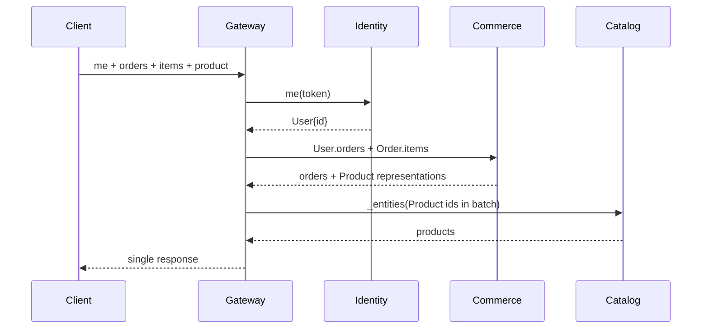

# GraphQL Federation

Return to [[Mapa do Projeto]]. Related to [[Identidade OAuth2]],
[[Subscriptions SSE]], [[Apollo MCP]], and [[Notas da Entrevista]].

## Mental model

The supergraph is a single contract composed of subgraph SDLs. The
gateway/router generates a query plan and fetches each field from the subgraph
that owns it. Federation is not a proxy that simply forwards the entire query.

## Rules for using it correctly in this project

1. **SDL is the source of truth.** Resolvers and TypeScript types are derived
   from or checked against versioned `.graphql` files.
2. **An entity has global identity.** An `@key` is stable, resolvable, and has
   `__resolveReference` covered by a test.
3. **A field has a clear owner.** Use `@shareable` only when every subgraph can
   resolve the field in a semantically equivalent way.
4. **Relationships are types, not leaking IDs.** Commerce returns a `Product`
   representation; catalog hydrates the product.
5. **Authorization does not live only at the edge.** The gateway authenticates
   and subgraphs protect ownership with trusted context.
6. **Lists use Relay in the datasource.** Use an opaque cursor, stable keyset,
   and correct `PageInfo`; never load everything into memory.
7. **DataLoader is created per request.** This includes reference resolvers;
   global caches can leak data between users.
8. **Composition is a CI gate.** The supergraph is an artifact generated by
   Rover.
9. **The query plan is evidence.** The `me` query measures SQL/HTTP calls to
   prove the absence of N+1.
10. **Subscription requires a separate PoC.** Apollo multipart and
    `graphql-sse` are not the same protocol.
11. **WordPress is plugin-first.** Reuse the schema, Connections, mutations,
    and loaders from WPGraphQL/WooGraphQL; create a custom wrapper only after a
    reproducible failure.

## Relay is not optional

The specification indicated in the interview defines the observable contract
for all lists: `edges`, `node`, opaque cursor, `pageInfo`, `first`/`after`, and,
when correctly supported, `last`/`before`. The implementation must reuse the
Connections from the WordPress datasource and test them through the gateway,
without fetching everything and paginating in memory.

## Federated path for `me`

## Review checklist

- [ ] `@link` uses a pinned version and imported directives.
- [ ] No `@key` is without a working reference resolver.
- [ ] Each field's ownership is documented.
- [ ] All Connections pass introspection and edge cases.
- [ ] Loaders are request-scoped and preserve key order.
- [ ] Composition and the critical query run in CI.
- [ ] Counters demonstrate batching.
- [ ] The subscription transport has been proven, not assumed.
- [ ] The WordPress plugin composes with Rover and preserves Relay/ownership/batching.

Executable details: [Federation PRD](../prds/02-graphql-federation.md).
