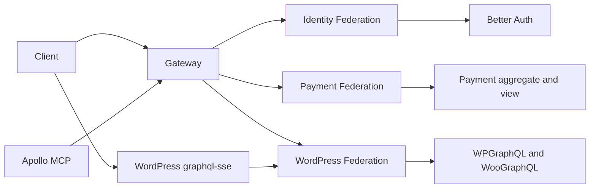

# Project Map

This is the Obsidian memory entry point.

The delivered topology has five deployable applications: Apollo MCP, Gateway,
Identity Federation, Payment Federation, and WordPress Federation. The E2E
project is an executable proof project, not a sixth runtime. The canonical
decision-to-test matrix is the [federated platform architecture
review](../evidence/federated-platform-refactor/review.md).

## Core

- [[Notas da Entrevista]] — indicated links and decisions not to recreate what already exists.
- [[GraphQL Federation]] — composition, entities, Relay, and DataLoader.
- [[Identidade OAuth2]] — Better Auth, audience, scopes, and WordPress binding.
- [[Saga e Idempotência]] — order, outbox/inbox, payment, and inventory.
- [[Subscriptions SSE]] — stream by operation key and protocol risk.
- [[Apollo MCP]] — curated tools and parity with the supergraph.

## PRDs

- [PRD Index](../prds/README.md)
- [Architecture and domain](../prds/01-arquitetura-e-dominio.md)
- [Roadmap](../prds/07-roadmap.md)
- [Risks and pending decisions](../prds/08-riscos-e-decisoes-pendentes.md)

## Main relationship

## Review path

1. Read [ADR 007](../adrs/007-federated-platform-boundaries.md) for the runtime
   inventory and inward dependency rule.
2. Follow the provider boundaries in `libs/platform/nest`, `libs/gateway/nest`,
   `libs/identity/nest`, `libs/wordpress/nest`, and Payment's Spring
   configuration.
3. Inspect the versioned SDL under `libs/contracts/graphql`, then run the
   composition gate from the [local development runbook](../runbooks/local-development.md).
4. Run the isolated buyer journey from the [E2E runbook](../runbooks/e2e.md).
5. Use the [architecture review](../evidence/federated-platform-refactor/review.md)
   to trace each responsibility, provider boundary, domain decision, and
   deliberately omitted abstraction to executable evidence.
