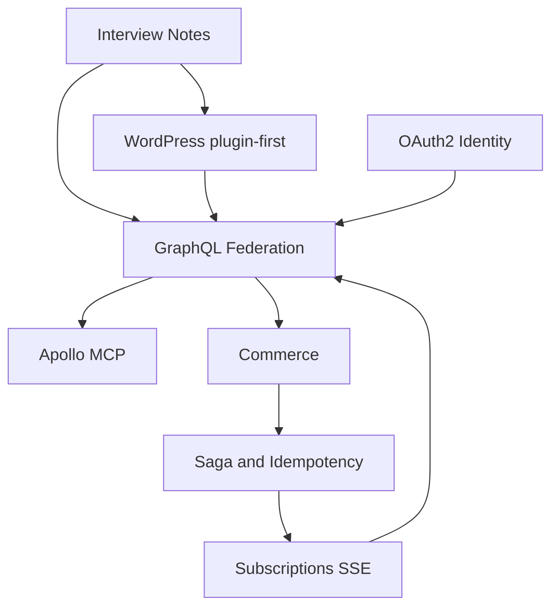

# Project Map

This is the Obsidian memory entry point.

## Core

- [[Notas da Entrevista]] — indicated links and decisions not to recreate what already exists.
- [[GraphQL Federation]] — composition, entities, Relay, and DataLoader.
- [[Identidade OAuth2]] — Better Auth, audience, scopes, and WordPress binding.
- [[Saga e Idempotência]] — order, outbox/inbox, payment, and inventory.
- [[Subscriptions SSE]] — stream by operation key and protocol risk.
- [[Apollo MCP]] — curated tools and parity with the supergraph.

## PRDs

- [PRD Index](../prds/README.md)
- [Architecture and domain](../prds/01-arquitetura-e-dominio.md)
- [Roadmap](../prds/07-roadmap.md)
- [Risks and pending decisions](../prds/08-riscos-e-decisoes-pendentes.md)

## Main relationship

