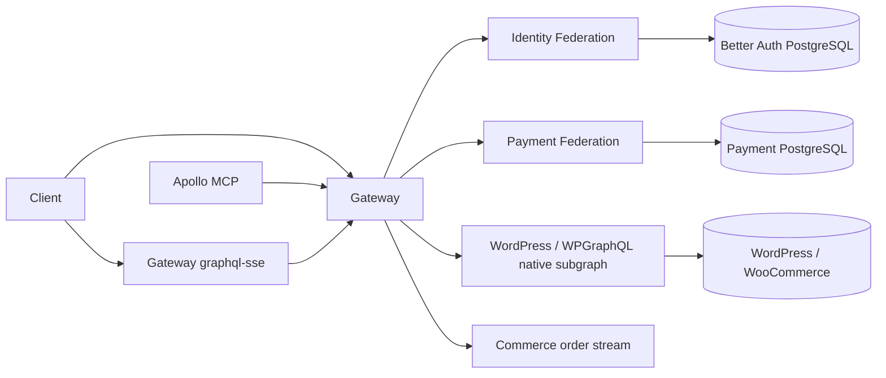

# PRD 01 — Architecture and domain

## Expected outcome

The platform converges on the five deployable applications fixed by
[ADR 007](../adrs/007-federated-platform-boundaries.md). Each process has one
business responsibility, native products keep authority over their data, and
framework code stays outside domain and application code.

## Principles

- Domain and application code do not depend on NestJS, Spring configuration,
  GraphQL, persistence adapters, WordPress clients, or messaging clients.
- Each bounded context owns its data and exposes it through an explicit port,
  versioned contract, or federated entity reference.
- Better Auth owns users, accounts, sessions, and OAuth persistence.
- WordPress/WooCommerce owns products, carts, orders, customers, and inventory.
- Payment owns payment invariants, idempotent commands, and payment read views.
- The gateway authenticates and propagates identity; every owning federation
  independently enforces scope and ownership for sensitive operations.
- Existing framework and product capabilities are selected before custom code.

## Bounded contexts

| Context    | Responsibility                                                              | Authoritative state                                      | Runtime                     |
| ---------- | --------------------------------------------------------------------------- | -------------------------------------------------------- | --------------------------- |
| Identity   | Authentication, OAuth, registration, sessions, and identity graph fields    | Better Auth schema in PostgreSQL                         | Identity Federation         |
| Commercial | Catalog, cart, checkout, orders, customers, stock, and order transitions    | WordPress/WooCommerce in MySQL                           | External WordPress subgraph |
| Workflow   | Checkout idempotency, outbox/inbox, and event delivery                      | Workflow state in PostgreSQL                             | Order Workflow Federation   |
| Payment    | Authorization, Pix generation, compensation, idempotency, and payment views | Payment aggregate and dedicated projection in PostgreSQL | Payment Federation          |
| Edge       | Authenticated graph composition and MCP operations                          | No domain persistence                                    | Gateway and Apollo MCP      |

The end-to-end project is part of the Nx graph but not deployed. WordPress
bootstrap, plugins, and fixtures are support assets rather than another runtime.

## Target Nx applications

```text
apps/
├── apollo-mcp/              authenticated MCP operations through Gateway
├── gateway/                 authenticated query/mutation federation edge
├── identity-subgraph/       Identity Federation with Better Auth
├── order-workflow-subgraph/       durable checkout workflow and RabbitMQ boundary
├── payment-federation/       Payment Federation with Java 21 and Spring Boot
└── e2e/                     non-deployable Vitest/Testcontainers project
```

`apps/stock-worker` is retired; its inventory reaction is an internal Payment
Federation service. `apps/wordpress-integration` retains only reproducible
WordPress infrastructure assets and is not a deployable Nx application.

## Target libraries

```text
libs/
├── contracts/graphql/       versioned SDL, operations, and composition input
├── platform/nest/           providers proven reusable by two or more runtimes
├── gateway/nest/            Gateway edge providers and authenticated data source
├── identity/nest/           Better Auth factories, registration, and resolvers
```

Payment keeps its domain, application command/query handlers, GraphQL adapter,
and Spring configuration in its Gradle project. A library is not created solely
to mirror the directory structure used by another language or context.

## Dependency direction

```text
composition -> adapters -> application -> domain
                         -> versioned contracts
```

- Domain imports no framework or adapter.
- Application imports domain and declared ports, not concrete infrastructure.
- Adapters implement ports and may use GraphQL, persistence, WordPress, or a
  framework API.
- Composition modules bind adapters and lifecycle resources through dependency
  injection.
- Cross-context code uses contracts or federated references, never another
  context's adapter, internal service, or database.

Nx tags and source-level architecture tests both enforce these rules. Tags
protect project-to-project edges; source tests catch forbidden dependencies
inside mixed-language projects.

## Runtime flow



The Gateway exposes the SSE transport while Commerce owns and publishes the
order stream. The Gateway owns no catalog or order repository. WordPress
exposes commercial graph operations directly through native
WPGraphQL/WooGraphQL behavior and `wp-graphql-federations`. Payment Federation exposes its own graph
fields and commands; it never writes WooCommerce storage directly.

## Data and consistency

- Better Auth APIs and models are the only access path to Better Auth records.
- WooCommerce identifiers are stable commercial references in the graph.
- A payment command uses an operation key and canonical request hash. Duplicate
  or concurrent execution persists one effect and returns an equivalent view.
- Payment state changes and their dedicated read representation commit in the
  transaction defined by the Payment application handler.
- Native WooCommerce behavior owns cart, checkout, inventory, and commercial
  order transitions. A missing capability requires a failing compatibility
  test before custom plugin or adapter code is added.
- No cross-database transaction is implied by federation. Reconciliation, if a
  demonstrated scenario needs it, belongs to a specific owner use case rather
  than a generic platform saga.

## Deliberate omissions

There is no generic DDD framework, base repository, application-wide base
service, distributed command bus, event sourcing platform, Commerce database,
Stock worker, or Identity MikroORM model. RabbitMQ and a transactional outbox
are not retained without a proven asynchronous requirement. These omissions
reduce competing sources of truth and keep framework composition reviewable.

## Executable evidence

- `test/federated-platform-refactor.test.mjs` locks the runtime inventory from
  ADR 007; the integration task later compares it with the Nx project graph.
- `test/architecture-boundaries.test.mjs` scans domain and application imports
  and validates the documented inward dependency matrix.
- Focused Identity, Gateway, Payment, WordPress, and subscription tests prove
  provider composition and context ownership as those runtimes are refactored.
- `quality:nx`, Rover composition, and the end-to-end project remain final gates;
  documentation tests do not substitute for build or behavior evidence.
