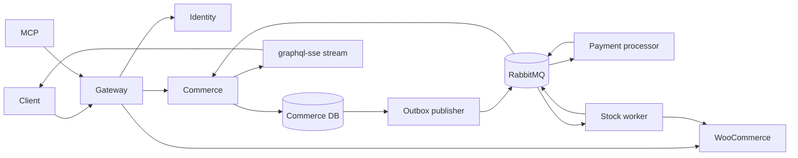

# PRD 01 — Architecture and domain

## Principles

- The domain does not depend on NestJS, GraphQL, an ORM, or RabbitMQ.
- Each context owns its data; integration crosses ports or events.
- Federated IDs are stable and do not expose fragile internal keys.
- Reuse WordPress, WooCommerce, WPGraphQL, and existing plugin capabilities
  first; custom code covers only a gap demonstrated by a PoC.
- Local writes and event publication use a transactional outbox.
- Consumers are idempotent by `eventId` and business key.
- The gateway authenticates; each subgraph also authorizes sensitive operations.

## Proposed bounded contexts

| Context | Responsibility | Entities/aggregates | Proposed persistence |
|---|---|---|---|
| Identity | user, session, OAuth, WordPress link | User, Account, OAuthClient, SupplierCompany | PostgreSQL; Better Auth owns its tables, while MikroORM owns first-party tables |
| Federated WordPress | commercial catalog and orders, with native WPGraphQL/WooGraphQL capabilities | Product, Category, Order, OrderItem | WordPress/MySQL is the authoritative source |
| Commerce | idempotency, journey orchestration, saga, and stream | Cart or reference to the Woo cart, CheckoutOperation, OrderWorkflow | PostgreSQL through MikroORM, without duplicating the full commercial order |
| Payment | idempotent charging and compensation | Payment, PaymentAttempt, InboxRecord | dedicated PostgreSQL, separate runtime |
| Inventory | reservation and release in WooCommerce | StockReservation | local inbox + WooCommerce |
| Edge/MCP | composition, auth, transports, and tools | no persistent domain | stateless |

## Proposed Nx apps

```text
apps/
├── gateway/                 NestJS, auth, and supergraph entry point
├── identity-subgraph/       Better Auth + User/Supplier
├── commerce-subgraph/       checkout, saga workflow + subscription
├── catalog-subgraph/        minimum fallback, only if the WP plugin fails in the PoC
├── stock-worker/            reservation/compensation
├── apollo-mcp/              configuration and allowed operations
├── payment-processor/       Java 21 + Spring Boot + Gradle
└── e2e/                     Vitest + Testcontainers
```

WordPress, RabbitMQ, and databases are infrastructure services; they do not need
to be represented as TypeScript apps. The Java processor is registered in the
same Nx project graph through `@nx/gradle`, with cacheable `build`, `test`, and
`docker` targets.

## Proposed Nx libs

```text
libs/
├── contracts/graphql/       SDL, registered operations, and composition
├── contracts/events/        versioned event envelopes and schemas
├── auth/nest/               guards/context without containing the AS
├── observability/           logging, metrics, and trace propagation
├── testing/                 fixtures, clients, and call counters
├── identity/{domain,application,infrastructure}
├── commerce/{domain,application,infrastructure}
└── catalog/{domain,application,infrastructure}
```

Nx tags must prevent `domain -> infrastructure` dependencies, direct access from
one context to another's persistence, and imports of apps by libs.

## Synchronous and asynchronous flow



## Data and consistency

- A local transaction reserves `(userId, operationKey)`, creates the workflow,
  and writes the outbox; the commercial order remains in WooCommerce.
- Because the remote Woo write does not participate in the PostgreSQL transaction,
  the adapter uses an idempotent reference and a reconciler resumes pending operations.
- The publisher marks the outbox as sent only after broker confirmation.
- Each consumer writes the `eventId` to the inbox in the same transaction as the effect.
- Order state is monotonic: old/duplicate events do not regress status.
- The initial result is reused on retries with the same key; an incompatible payload
  with an already-used key must fail with a deterministic conflict.

## Proposed, still reversible decisions

- PostgreSQL for identity, commerce, and payment, with separate databases.
- MikroORM for first-party NestJS persistence, repositories, transactions, and
  migrations. Better Auth remains the sole owner of its internal schema and adapter.
- Java 21 and Spring Boot for the payment processor, built with Gradle and integrated
  into the Nx task graph through `@nx/gradle`.
- Direct participation by WordPress in the supergraph with
  `wp-graphql-federations`; a minimal NestJS adapter/wrapper is only a fallback
  for proven composition, authorization, or batching gaps.
- Versioned topic exchange (`marketplace.events.v1`) with semantic routing keys.

See [risks and decisions](08-riscos-e-decisoes-pendentes.md) before committing
these proposals to code.
