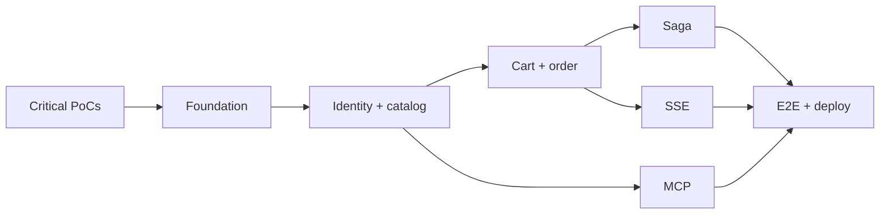

# PRD 07 — Implementation roadmap

## Strategy

Deliver vertical slices that eliminate risk early. The E2E test starts in the
first milestone as an executable skeleton and gains steps as capabilities are
added. Do not leave gateway/SSE, multi-audience OAuth, or WordPress until the end.

## Milestone 0 — Compatibility proofs

**Objective:** resolve risks that could invalidate the architecture.

- `graphql-sse` client → gateway → subgraph PoC under Federation v2.
- Better Auth PoC issuing a token accepted by the gateway and Apollo MCP according to the E2E.
- Plugin-first PoC with WPGraphQL, WPGraphQL for WooCommerce, and
  `wp-graphql-federations`: Rover composition, `Product`/`Order`, Relay,
  ownership, and batching observed by the gateway.
- Confirm the SST version and deadline interpretation.

**Output:** finalized ADRs, pinned plugin versions/commits, and reproducible spike
tests. A custom wrapper is introduced only if one of these tests exposes a gap.

## Milestone 1 — Monorepo foundation and contracts

- Nx generators, tags, and module boundaries;
- empty apps/libs with health/readiness;
- identity/catalog/commerce SDLs and Rover composition;
- event schemas and a common envelope;
- basic Docker Compose and Testcontainers harness.

**Gate:** a clean clone composes the supergraph and starts a healthy skeleton.

## Milestone 2 — Identity and federated catalog

- Better Auth OAuth Provider/JWT and NestJS integration;
- client seed;
- registration with a WordPress link;
- `users`, `user`, `me`, and SupplierCompany;
- federated Woo catalog/orders and product ownership, reusing existing schema and
  mutations;
- request-scoped Connections and DataLoader.

**Gate:** a valid token queries `me`; an incorrect supplier is rejected; N+1 is measured.

## Milestone 3 — Cart and idempotent order

- Cart and Order;
- MikroORM repositories and versioned migrations for first-party commerce data;
- order/item Connections;
- idempotency constraint + command hash;
- outbox publisher;
- `me` traverses orders and products.

**Gate:** sequential/concurrent retries create one order; the federated query is complete.

## Milestone 4 — Payment, inventory, and saga

- Java 21/Spring Boot processor with ports/adapters, health, and graceful shutdown;
- Gradle targets registered in Nx through `@nx/gradle`;
- inbox/idempotency and confirmed publishing;
- inventory worker and compensation;
- retry/backoff/DLQ;
- card and Pix through their terminal states.

**Gate:** simulated duplicates and crashes do not duplicate effects; compensation passes.

## Milestone 5 — Subscription SSE

- stream by operationKey, including before the mutation;
- stream auth/ownership;
- federated propagation through the design validated in Milestone 0;
- comparison of the terminal state with the read model.

**Gate:** the subscribe → mutate → terminal journey passes for card and Pix.

## Milestone 6 — Apollo MCP

- registered operations and whitelist;
- auth issuer/audience/scope;
- token propagation to the gateway;
- MCP Inspector and `me` parity.

**Gate:** the tool and query return the same object; negative tests pass.

## Milestone 7 — E2E, performance, and deployment

- complete workflow in one command;
- ≥ 70% coverage in critical domains;
- P95 load testing and N+1 counters;
- final images, Compose, and operational documentation;
- validate the unified Nx graph, affected execution, and local/CI cache across
  Node and Java projects; do not add a custom TUI without a demonstrated gap;
- SST, `sst diff`, deployment, and evidence;
- OpenTelemetry as a differentiator.

**Gate:** all deliverables and criteria from section 18 of the README are traced.

## Critical order

After M3, saga, SSE, and MCP have parallelizable parts, but final integration
remains serial through the same E2E. Each milestone must become its own feature
spec before implementation, with annotated and auditable criteria.
